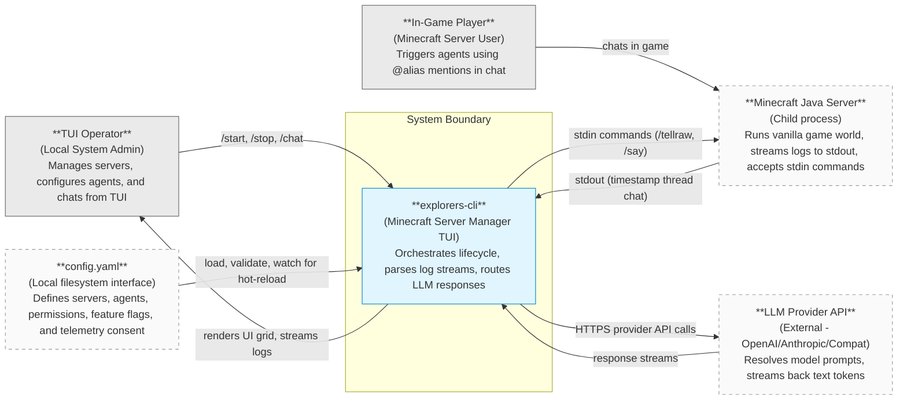

# 01-context.md — System Context (C4 Level 1)

This document describes the high-level system context for `explorers-cli` (Minecraft Server Manager TUI). It details how the single-process application resides in its environment, its boundary, and its relationships with players, operators, and external services.

## C4 Level 1 — System Context Diagram

The following diagram outlines the relationship of the system to its human users and external interfaces.

## System Boundaries

The `explorers-cli` system acts as a local coordinator layer. Its scope boundary divides local CLI interactions, sandboxed child-process streams, and secure API transport layers.

### What is INSIDE the System Boundary

- **TUI Renderer**: Renders the terminal windows using React layout components from `@opentui/react`.
- **Server Manager Core**: Controls starting, stopping, and restarting child processes using Bun's native `Bun.spawn`, and reads log streams.
- **Mention Detector**: Intercepts in-game player `@mention` prompts from stdout.
- **Agent Engine Integration**: Orchestrates agent personas and executes tools via `@infinityi/engine-lib`.
- **Local Stores**: Manages `data/sessions.db` via SQLite for chat memory and `data/pids.json` for server PID tracking.
- **Configuration Watcher**: Reads and validates `config.yaml` with hot-reload support.

### What is OUTSIDE the System Boundary

- **Minecraft Java Executable**: The system spawns standard Java child processes but does not distribute or compile the server JARs.
- **External LLM APIs**: OpenAI, Anthropic, or other hosted LLM providers configured in `config.yaml`.
- **Network Infrastructure**: The host system's IP/ports and networking bindings.
- **Host Operating System Process Groups**: The host OS (Windows/Linux) process table and job objects.
- **Local Configuration File**: `config.yaml` on the host filesystem is an external input watched by the Configuration Service. The system reads, validates, and hot-reloads it but treats file creation, deletion, and edits as operator/host actions outside the process boundary.

## External Actors & Systems

| Component                 | Category             | Description & Rationale                                                                                                                                                                   |
| ------------------------- | -------------------- | ----------------------------------------------------------------------------------------------------------------------------------------------------------------------------------------- |
| **TUI Operator**          | User (Human)         | The local administrator who executes the application. They configure server specs, toggle feature flags, monitor logs, and can chat with offline agents directly in the TUI.              |
| **In-Game Player**        | User (Human)         | Minecraft game players connected to the local servers. They interact with the manager's AI agents via in-game chat triggers without accessing the TUI directly.                           |
| **Minecraft Java Server** | External Process     | Spawned Java instances executing vanilla Minecraft. They output standard log lines (which `explorers-cli` parses) and accept administrative stdin writes (e.g. `/tellraw` notifications). |
| **LLM Provider API**      | External Service     | Hosted LLM platforms (OpenAI, Anthropic, or compatible routers) that process agent prompts and return token streams back to the TUI and in-game delivery channels.                        |
| **config.yaml**           | Local File Interface | Host filesystem configuration source loaded at startup and watched for hot-reload. It defines servers, agents, providers, permissions, feature flags, and telemetry consent.              |
