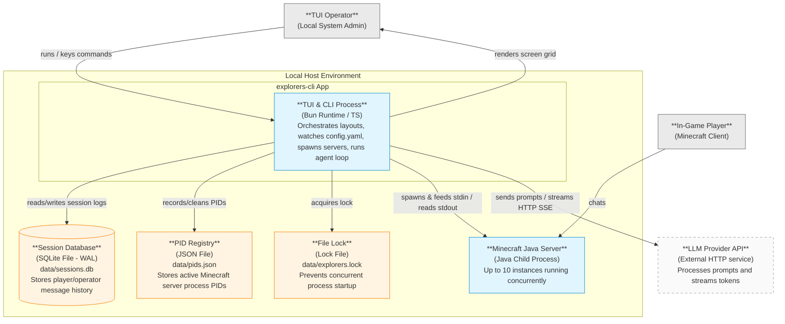

# 02-architecture.md — Container View (C4 Level 2)

This document describes the container-level architecture (C4 Level 2) of the Minecraft Server Manager TUI. It decomposes the single-process application and its immediate environment into runnable containers, external systems, and supporting data/resources.

## C4 Level 2 — Container Diagram

The diagram below represents the system's container layout. In C4 terms, the runnable containers are the TUI/CLI process and managed Minecraft Java server processes. The SQLite database, PID registry, and lock file are supporting data/resources owned by those containers, not separately runnable containers.

## Runtime Containers Summary

| Container                 | Tech Category              | Responsibility & Rationale                                                                                                                                                                                                                                                                                              | Key Requirements Met                                      |
| ------------------------- | -------------------------- | ----------------------------------------------------------------------------------------------------------------------------------------------------------------------------------------------------------------------------------------------------------------------------------------------------------------------- | --------------------------------------------------------- |
| **TUI & CLI Process**     | Bun Runtime (TypeScript)   | The main execution process. It compiles code on the fly, monitors config changes, handles operator input/output layouts, detects agent mentions in stdout logs, calls the LLM provider, and enforces tool safety policies. Separating this from the Minecraft process ensures the manager survives game server crashes. | `FR-SRV-001`, `FR-CHAT-001`, `FR-HOT-001`, `NFR-PERF-001` |
| **Minecraft Java Server** | Java Virtual Machine (JVM) | Running instance of vanilla Minecraft. It handles game logic, tick rates, and network communication with connected players. Spawning this as a child process under the TUI process allows stdin command redirection and stdout log streaming without RCON.                                                              | `FR-SRV-001`, `MCIF-1`, `NFR-COMP-003`                    |

## Supporting Data and Local Resources

| Resource             | Tech Category | Responsibility & Rationale                                                                                                                                                                                                        | Owner Container   | Key Requirements Met                      |
| -------------------- | ------------- | --------------------------------------------------------------------------------------------------------------------------------------------------------------------------------------------------------------------------------- | ----------------- | ----------------------------------------- |
| **Session Database** | SQLite WAL    | Persistence file located at `data/sessions.db`. It stores conversation histories for agents and players. It is isolated from the main process memory space so that session context is preserved between app restarts and crashes. | TUI & CLI Process | `FR-SES-001`, `FR-SES-002`, `NFR-REL-004` |
| **PID Registry**     | JSON File     | Flat file located at `data/pids.json` mapping `serverId` to its active process ID. It persists PID records so that the application can clean up orphan Java processes during initialization after a hard host crash.              | TUI & CLI Process | `FR-SRV-018`, `FR-SRV-019`, `NFR-REL-003` |
| **File Lock**        | Lock File     | Exclusive system lock file located at `data/explorers.lock`. It guarantees that only one instance of the manager process can access the databases and PID records on a local host.                                                | TUI & CLI Process | `FR-SRV-020`, `AC-035`                    |

## Integration Styles & Rationale

- **TUI/CLI to Minecraft Server (IPC Pipes)**:
  - _Style_: Synchronous stdin stream writes and asynchronous stdout/stderr stream reading.
  - _Rationale_: Avoids RCON security configuration overhead (FR-SRV-008) and provides direct access to logs for mention parsing without disk tailing.
- **TUI/CLI to Session Database (Native SQLite Driver)**:
  - _Style_: File-system queries using Bun's native `bun:sqlite` API with Write-Ahead Logging (WAL).
  - _Rationale_: WAL mode prevents query blocking during concurrent player agent triggers (FR-SES-002).
- **TUI/CLI to PID Registry / File Lock (Filesystem IPC)**:
  - _Style_: Atomic file writes and exclusive file lock handles.
  - _Rationale_: Lightweight, zero-dependency mechanism to track processes and prevent concurrent write collisions.
- **TUI/CLI to LLM Provider API (HTTPS API)**:
  - _Style_: Asynchronous HTTPS queries using Server-Sent Events (SSE) streaming.
  - _Rationale_: Minimizes memory buffering (NFR-REL-006) and provides immediate token responses to the operator interface (FR-INV-002).

## Cross-Cutting Concerns

### 1. Authentication & Permissions

All command triggers from in-game players are parsed, and player names are checked against `permissions.<serverId>.players` in the configuration. Access is denied-by-default (FR-CHAT-008). In normal mode, local operator CLI command access is trusted with full permissions. All operator-originated commands still flow through the shared command router so global runtime gates such as `--read-only` can block mutating actions before they reach the Server Process Manager, Agent Executor, or Configuration Service (`ADR-008`).

### 2. Observability & Auditing

The application logs structural logs to `logs/explorers-cli.log` using rotation patterns (NFR-OBS-001). Agent actions, particularly tool commands and sandboxed filesystem modifications, write audit records capturing the operator/player name, server ID, and execution timestamps (FR-TOOL-011).

### 3. Error Boundary and Resiliency

- **Server Crashes**: The TUI process monitors child exit codes. A non-zero exit sets server state to `failed` within 2 seconds (FR-SRV-014).
- **Config Erasure**: If `config.yaml` is deleted during execution, the Configuration Service retains the last known good runtime snapshot, emits a visible warning, and does not publish an empty/invalid configuration (NFR-REL-007, `ADR-008`).
- **Runtime Modes**: Bootstrap selects normal TUI, read-only TUI, or validation-only mode. `--validate-config` exits after config validation without launching runtime side effects; `--read-only` starts observer mode and blocks operator-originated mutations at the command router (`ADR-008`).
- **API Timeout**: An in-flight LLM request that hangs is aborted after the configured timeout. The session remains open, and a TUI warning is generated (FR-INV-003).
