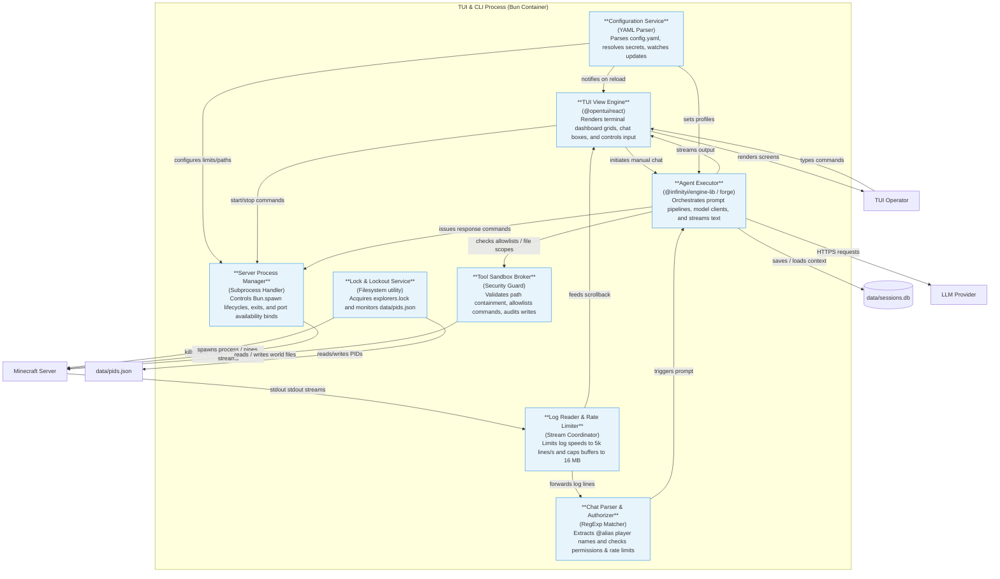

# 03-components.md — Component View (C4 Level 3)

This document breaks down the internal components of the **TUI & CLI Process** container. It details the structural sub-modules that govern configuration parsing, TUI rendering, child process control, chat parsing, and agent routing.

## C4 Level 3 — Component Diagram: TUI & CLI Process

All components inside this container execute in a single Bun runtime process. They communicate via event emitters, direct function calls, and shared state stores.

## Component Dictionary

### 1. TUI View Engine (`@opentui/react`)
* **Responsibility**: Renders the terminal dashboard layouts (server tables, scrollable logs, active metadata, and token-by-token agent chat output) and captures CLI operator keys.
* **Why Separate**: Isolates visual rendering rules from the underlying system IPC processes and database operations.
* **Dependencies**: `config_service` (for metadata), `server_mgr` (for server statuses), `agent_executor` (for chat history).

### 2. Configuration Service
* **Responsibility**: Loads `config.yaml` at boot, resolves `${ENV_VAR}` variables (FR-CFG-012), validates schemas, watches the filesystem, and executes hot-reloads (FR-HOT-001).
* **Why Separate**: Isolates configuration parsing, schema validation, and retry recovery mechanisms.
* **Dependencies**: `tui_view`, `server_mgr`, `agent_executor` (publishes reload event notifications).

### 3. Lock & Lockout Service
* **Responsibility**: Inspects and writes `data/explorers.lock` (FR-SRV-020) and `data/pids.json` (FR-SRV-018) during boot. Cleans up orphan processes.
* **Why Separate**: Runs exclusively as a boot-level check to ensure single-process safety.
* **Dependencies**: None.

### 4. Server Process Manager
* **Responsibility**: Manages the child Java processes (`Bun.spawn`). Enforces startup timeouts (FR-SRV-010), checks port availability via network TCP binds (FR-SRV-008), triggers stop commands via `/stop`, and tracks processes.
* **Why Separate**: Decouples OS-level process management (Linux process groups/Windows job objects) from game logic.
* **Dependencies**: `lock_service` (reads/writes PIDs), `log_reader` (intercepts process stdout).

### 5. Log Reader & Rate Limiter
* **Responsibility**: Rate-limits incoming stdout logs to 5000 lines/second (NFR-PERF-004) and caps in-memory scroll buffers to 16 MB (NFR-REL-006) to prevent Node OOMs.
* **Why Separate**: Protects the main event loop from CPU/memory starvation during startup log storms.
* **Dependencies**: `server_mgr` (provides stdout socket), `tui_view` (updates log logs), `chat_parser` (scans log lines).

### 6. Chat Parser & Authorizer
* **Responsibility**: Evaluates log lines matching standard vanilla formats, extracts candidate players, checks player permissions (case-insensitive) (FR-CHAT-008), and enforces rate-limiting windows (FR-CHAT-009).
* **Why Separate**: Separates raw regex string search logic from LLM prompt construction.
* **Dependencies**: `log_reader` (receives lines), `agent_executor` (initiates prompt when authorized).

### 7. Agent Executor (`@infinityi/engine-lib`)
* **Responsibility**: Coordinates provider prompts (OpenAI/Anthropic), loads history segments from SQLite, feeds N preceding chat lines (FR-CHAT-011), applies timeouts (FR-INV-003), and sends `/tellraw` chunks (FR-INV-009).
* **Why Separate**: Centralizes LLM communications, prompt orchestration, and response distribution rules.
* **Dependencies**: `db_file` (SQLite WAL reads/writes), `tool_broker` (validates tool schemas), `server_mgr` (sends game commands).

### 8. Tool Sandbox Broker
* **Responsibility**: Intercepts tool execution requests. Restricts file operations to `server.path` (FR-TOOL-008), blocks symlink traversal (FR-TOOL-009), blocks writes/moves/NBT updates when server runs (FR-TOOL-006), and enforces token allowlists (FR-TOOL-004).
* **Why Separate**: Serves as the primary security firewall protecting the host system from malicious or misbehaving agent actions.
* **Dependencies**: `config_service` (fetches allowed scopes).

---

## Containers Intentionally Skipped for L3 Decompositions
* **Minecraft Java Server**: Black-box external subprocess. We do not design its internals.
* **SQLite Session Database**: Standard SQL persistence engine. No custom internal code.
* **File lock / JSON files**: Passive operating-system storage files.
