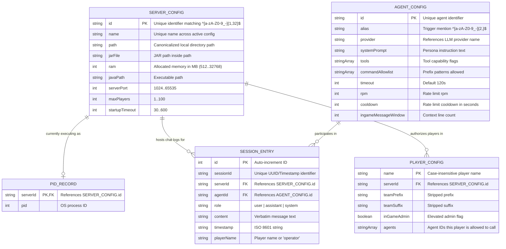

# 04-data-model.md — Conceptual Data Model

This document outlines the conceptual data structures for `explorers-cli`. It specifies the relationships between user-configured settings, ephemeral runtime tracking metrics, and the SQLite session store.

## Conceptual ER Diagram

The diagram below connects configuration data (sourced from `config.yaml`), runtime process sheets (`pids.json`), and the chat log table (`sessions.db`).

## Entity Details

### 1. SERVER_CONFIG & AGENT_CONFIG (YAML In-Memory)

- **Lifecycle**: Read from `config.yaml` during application startup. Instantly refreshed on successful hot-reloads. If `config.yaml` is deleted while running, the active in-memory configuration is retained and the TUI surfaces the condition without crashing. Entries are removed from active memory only after a valid hot-reload explicitly removes them, subject to the rule that running servers cannot be removed until stopped.
- **Volume**: Small (typically 1 to 10 servers, 1 to 5 agents).
- **Access Patterns**: Iterated at startup to validate structures and binds. Searched by `serverId` on start/stop triggers and by `agentId` / `alias` during chat parser passes.

### 2. PLAYER_CONFIG (YAML In-Memory)

- **Lifecycle**: Loaded from the configuration file. Case-insensitive fields are parsed and stored in memory.
- **Volume**: Small (typically 1 to 50 players per server).
- **Access Patterns**: Queried case-insensitively when a player triggers an agent alias. Validates if the player exists and holds access rights to the agent ID.

### 3. PID_RECORD (JSON Persistence - `data/pids.json`)

- **Lifecycle**: Created when a child process is successfully spawned. Deleted from the tracking map when a server reaches `stopped` state. Checked and cleared during boot cleanup sequence.
- **Volume**: Capped at 10 active records (matching the server limit).
- **Access Patterns**: Written atomically whenever process IDs are assigned. Checked sequentially on boot to terminate stray processes.

### 4. SESSION_ENTRY (SQLite Table - `data/sessions.db`)

- **Lifecycle**: Appended immediately on incoming player/operator messages and downstream LLM token-stream outputs. Rows are periodically pruned when they exceed the `EXPLORERS_CLI_SESSION_RETENTION` duration (default 30 days).
- **Volume**: High growth. Under active playing conditions, this can scale to tens of thousands of lines.
- **Access Patterns**:
  - _Writes_: Appended sequentially during agent conversations.
  - _Reads_: Fetches the last `ingameMessageWindow` historical rows matching the active `serverId + agentId` session key to reconstruct LLM history (FR-SES-004).
  - _Pruning_: Run-swept at startup and every 24 hours.

## Patterns & Flags

- **Shared Multi-Tenant Session Key**: All players and the TUI operator share the exact same database context window for a given `serverId + agentId` combination (FR-SES-004). This acts as a single-room group chat environment rather than private message silos.
- **Write-Ahead Logging (WAL)**: SQLite writes compile onto a concurrent WAL log. This is an architectural protection (NFR-REL-004) preventing database locks or journal corruption when different players trigger agents simultaneously (AC-022).
- **Case-Insensitive Lookup and Session Indexing**: Permission checks are executed case-insensitively in memory. The SQLite engine must create indexes on `(serverId, agentId)`, `(timestamp)`, and `(sessionId)` to support context fetches, pruning, and `/resume` lookup requirements (NFR-PERF-006).
