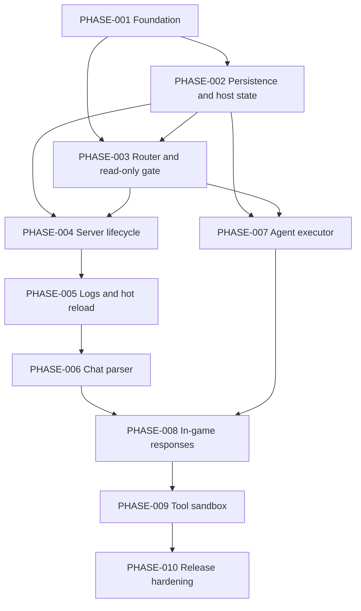

# Phase Plan - TUI & CLI Process

## Implementation Inventory

| Unit ID | Type | Summary | Source | Risk | Candidate phase |
| ------- | ---- | ------- | ------ | ---- | --------------- |
| IU-001 | delivery | Expand project scripts, dependency metadata, TypeScript strict checks, test command, and source layout. | `package.json`, `tsconfig.json`, `docs/lld/tui-cli-process/README.md` Stack inference | Medium | PHASE-001 |
| IU-002 | delivery | Establish forge lifecycle boot, ordered component startup/shutdown, signal handling, and validation-only short-circuit. | `design.md` Architecture, Concurrency model | Medium | PHASE-001 |
| IU-003 | contract | Build runtime config schema, YAML source adapter, env/secret resolution, and `--validate-config` diagnostics. | `design.md` Algorithm 4, `README.md` Assumption 10, ADR-LLD-003 | High | PHASE-001 |
| IU-004 | contract | Replace starter OpenTUI app with TUI shell and view-model subscription seams. | `design.md` capability mapping TUI View Engine, `README.md` scope | Medium | PHASE-001 |
| IU-005 | observability | Add structured log baseline, redaction, rotating file writer, telemetry null exporters, and crash report hook. | `observability.md` Logs, Traces, Redaction, Log rotation | High | PHASE-001 |
| IU-006 | reliability | Acquire and release `data/explorers.lock` as the single-instance guard. | `data-model.md` `data/explorers.lock`, `migration-plan.md` M-004, ADR-LLD-002 | High | PHASE-002 |
| IU-007 | data | Create and atomically maintain `data/pids.json`; model stale PID verification. | `data-model.md` `PidRegistry`, `migration-plan.md` M-002, `errors.md` `PID_STALE`/`PID_REUSED` | High | PHASE-002 |
| IU-008 | data | Open `data/sessions.db`, run engine-lib session schema, audit table migration, and `pruning_state` migration. | `data-model.md`, `migration-plan.md` M-001 | Medium | PHASE-002 |
| IU-009 | data | Add 24-hour session pruning state and metrics without pruning audit rows. | `data-model.md` `pruning_state`, `observability.md` Persistence metrics | Medium | PHASE-002 |
| IU-010 | contract | Load OpenAPI schemas for contract tests over operator, in-game, and tool surfaces. | `api.md`, `openapi.yaml`, `tests.md` Contract tests | Medium | PHASE-003 |
| IU-011 | security | Implement `MutatingCommandClassifier`, read-only command gate, and classification completeness tests. | ADR-LLD-003, `design.md` Algorithm 5, `sequences.md` section 8 | High | PHASE-003 |
| IU-012 | reliability | Implement operator idempotency cache with UUID and fallback hash keys, 5 second TTL, and lazy eviction. | `idempotency.md`, `sequences.md` section 7 | Medium | PHASE-003 |
| IU-013 | flow | Implement command router dispatch for `/help`, `/session`, `/resume`, and `/clear` with contract-shaped responses. | `api.md` Operator commands, `openapi.yaml` | Medium | PHASE-003 |
| IU-014 | domain | Implement domain value objects and runtime state for Server, Agent, Player, Session, Mention, ToolResult. | `domain.md` | Medium | PHASE-003 |
| IU-015 | flow | Implement server start: validation, port check, `Bun.spawn`, startup timeout, PID record, `Done!` transition. | `design.md` Algorithm 2, `sequences.md` section 1 | High | PHASE-004 |
| IU-016 | reliability | Implement stop/restart and process-tree cleanup for POSIX process groups and Windows Job Objects/taskkill fallback. | ADR-LLD-002, `design.md` Algorithm 2 graceful stop | High | PHASE-004 |
| IU-017 | reliability | Detect child exit, stdin close, crash status, PID deletion, audit events, and TUI state updates within 2 seconds. | `sequences.md` section 2, `errors.md` `CRASH`/`UNEXPECTED_STDIN_CLOSE` | High | PHASE-004 |
| IU-018 | flow | Add bounded log reader with forge token bucket, 16 MB ring buffer, dropped/evicted counters, and scrollback updates. | `design.md` Algorithm 3, ADR-005 mapping, `observability.md` Log ingestion metrics | Medium | PHASE-005 |
| IU-019 | flow | Render server status, scrollback, dropped counts, hot-reload banners, and pending restart markers in the TUI. | `design.md` Responsibilities, `observability.md` Dashboard | Medium | PHASE-005 |
| IU-020 | reliability | Implement hot-reload debounce, same-schema validation, last-known-good retention, changed-key diff, and atomic publish. | `design.md` Algorithm 4, `sequences.md` section 5 | High | PHASE-005 |
| IU-021 | security | Rebuild permission, agent, provider, and tool policy indexes on valid hot-reload. | `design.md` Algorithm 4, Caching table | Medium | PHASE-005 |
| IU-022 | domain | Implement vanilla chat regex, team prefix/suffix strip, player-name sanitization, first `@alias`, and help trigger. | `design.md` Algorithm 1, `openapi.yaml` `/ingame/chat` | Medium | PHASE-006 |
| IU-023 | security | Enforce deny-by-default player authorization, case-insensitive lookup, rpm limiter, and cooldown. | `design.md` Algorithm 1, `errors.md` `PERMISSION_DENIED_PLAYER`/`RATE_LIMITED_PLAYER` | High | PHASE-006 |
| IU-024 | observability | Emit mention authorized/denied/help audit, metrics, and log fields without leaking player content at INFO. | `observability.md` Chat parser metrics and logs | Medium | PHASE-006 |
| IU-025 | integration | Build provider registry, engine-lib agent definitions, event hub subscribers, resilience pipeline, and provider error mapping. | `design.md` Agent Executor row, `errors.md` provider mappings | High | PHASE-007 |
| IU-026 | data | Implement shared `(serverId, agentId)` session lookup, tenant scoping, LRU handles, append/load/recent operations. | ADR-LLD-004, `data-model.md` sessions, `domain.md` Session | High | PHASE-007 |
| IU-027 | flow | Implement operator `/chat` online/offline behavior, streaming tokens to TUI, timeout handling, and partial persistence. | `api.md`, `sequences.md` sections 4 and 4b | High | PHASE-007 |
| IU-028 | contract | Complete `/session`, `/resume`, and `/clear` behavior against persisted session data. | `openapi.yaml` Session schemas, `idempotency.md` `/clear` | Medium | PHASE-007 |
| IU-029 | flow | Wire Chat Parser mentions to Agent Executor with N-line context injection excluding the trigger line. | `sequences.md` section 3, `design.md` Agent Executor row | High | PHASE-008 |
| IU-030 | reliability | Implement chunked `/tellraw`, formatting strip, 500 ms pacing, `/say` fallback, and offline failure handling. | `design.md` Algorithm 6, `sequences.md` section 4c, `errors.md` `OFFLINE_FAIL` | High | PHASE-008 |
| IU-031 | security | Register engine-lib shell/fs tools with per-server roots, command allowlists, NBT deny rules, and server-state gate. | `design.md` Tool Sandbox Broker row, `openapi.yaml` AgentTools | High | PHASE-009 |
| IU-032 | contract | Validate `run_command`, `read_file`, and `write_file` tool schemas and ToolResult contract. | `openapi.yaml` tool schemas, `api.md` Agent tools | Medium | PHASE-009 |
| IU-033 | observability | Audit tool success, blocked, and failed outcomes with redacted targets and argument digests. | `data-model.md` `audit_entries`, `observability.md` `tool_blocked` | Medium | PHASE-009 |
| IU-034 | test | Maintain unit, integration, contract, and E2E coverage required by the LLD for each phase. | `tests.md` Test pyramid and key scenarios | High | All phases |
| IU-035 | test | Add performance/load test profiles for hot-reload, log ingestion, memory, and agent run latency. | `tests.md` Performance tests | Medium | PHASE-010 |
| IU-036 | delivery | Add packaging/release scripts for npm package or Bun compiled binary, release notes, and docs. | `README.md` Stack inference, HLD `06-deployment.md` | Medium | PHASE-010 |
| IU-037 | delivery | Add Windows/Linux CI matrix and evidence for process cleanup parity. | ADR-LLD-002 mitigations, `tests.md` Reliability | High | PHASE-010 |

## Dependency Graph

| From | To | Dependency reason |
| ---- | -- | ----------------- |
| IU-001 | IU-002 | Project scripts and source layout must exist before lifecycle boot is reviewable. |
| IU-002 | IU-003 | Config resolution is a boot component. |
| IU-003 | IU-011 | Runtime mode comes from resolved config/CLI sources. |
| IU-005 | IU-006 | Lock acquisition and file state changes need logging and redaction. |
| IU-006 | IU-007 | Lock must be acquired before touching `pids.json`. |
| IU-007 | IU-015 | Server start records PIDs immediately after spawn. |
| IU-008 | IU-013 | Session commands need an opened session store. |
| IU-008 | IU-026 | Agent sessions use the engine-lib SQLite store. |
| IU-010 | IU-013 | Router responses are validated against OpenAPI schemas. |
| IU-011 | IU-013 | Router dispatch must classify read-only behavior before handlers run. |
| IU-012 | IU-015 | Mutating server commands use idempotency before calling process manager. |
| IU-014 | IU-015 | Server lifecycle depends on domain state and value validation. |
| IU-015 | IU-016 | Restart composes stop then start. |
| IU-015 | IU-018 | Log reader attaches to spawned stdout. |
| IU-016 | IU-017 | Crash and cleanup behavior depends on owned child process handles. |
| IU-018 | IU-022 | Chat parser consumes normalized stdout lines from the log reader. |
| IU-020 | IU-021 | Changed-key publication drives index rebuilds. |
| IU-021 | IU-023 | Authorization depends on current permission indexes. |
| IU-022 | IU-023 | Rate limits only apply after a valid mention candidate exists. |
| IU-023 | IU-029 | Only authorized mentions trigger agent runs. |
| IU-025 | IU-027 | `/chat` requires provider and agent registry setup. |
| IU-026 | IU-027 | Online `/chat` persists to shared sessions. |
| IU-026 | IU-029 | In-game mentions use the same shared session key. |
| IU-027 | IU-030 | Delivery consumes final agent response. |
| IU-025 | IU-031 | Tool registration plugs into the provider and agent registry built earlier. |
| IU-031 | IU-033 | Tool audit depends on policy decisions. |
| IU-034 | All | Tests travel with each behavior. |
| IU-035 | IU-036 | Release readiness needs performance evidence. |
| IU-037 | IU-016 | Cross-platform cleanup evidence gates lifecycle completion. |

## Phase Summary

| Phase | Review shape | Major units | Deploy/rollback note |
| ----- | ------------ | ----------- | -------------------- |
| PHASE-001 | One PR | IU-001 to IU-005 | Safe to revert; no persisted data should be created except optional logs in test temp dirs. |
| PHASE-002 | One PR | IU-006 to IU-009 | Additive local state creation only; rollback deletes greenfield `data/*` and `logs/*` files in dev/test. |
| PHASE-003 | One PR | IU-010 to IU-014 | Router can ship with limited command set; mutating commands may return not implemented until later phases. |
| PHASE-004 | One PR or OS cleanup PR stack | IU-015 to IU-017, IU-037 partial | Rollback stops all children, clears PID registry, and reverts process manager modules. |
| PHASE-005 | One PR | IU-018 to IU-021 | Hot-reload failures must retain last known good config; rollback disables watcher and keeps boot config. |
| PHASE-006 | One PR | IU-022 to IU-024 | Parser can emit mention events without invoking agents until PHASE-008. |
| PHASE-007 | One PR | IU-025 to IU-028 | Provider calls are mock-backed in tests; production config must keep telemetry opt-in. |
| PHASE-008 | One PR | IU-029 to IU-030 | Delivery is safe to disable behind server running checks; persisted sessions remain valid. |
| PHASE-009 | One PR | IU-031 to IU-033 | Tool surface must fail closed; rollback removes tool registration from agent definitions. |
| PHASE-010 | One PR or release PR stack | IU-035 to IU-037 | No behavior changes without tests; release artifacts are additive. |

## Deployment And Rollback Sequence

1. PHASE-001 can be merged once `bun test` and strict TypeScript checks exist and pass.
2. PHASE-002 creates greenfield local state in the LLD migration order: lock, PID registry, SQLite, logs. Rollback in dev/test is a factory reset of `data/sessions.db*`, `data/pids.json`, and `logs/explorers-cli.log*`.
3. PHASE-003 exposes the command router and read-only gate. Later mutating command handlers can remain unavailable until their phase lands, but must not bypass the gate.
4. PHASE-004 is the first phase that spawns child processes. PR evidence must include cleanup proof and no orphan Java/stub children after tests.
5. PHASE-005 adds hot-reload. Invalid reloads must preserve the old snapshot; rollback disables dynamic reload without corrupting active config.
6. PHASE-006 through PHASE-009 add the user-visible AI loop incrementally. Each phase must keep previous flows working and fail closed on security-sensitive branches.
7. PHASE-010 finalizes cross-platform CI, performance, packaging, runbooks, and release evidence.

## Risk Register

| Risk ID | Risk | Impact | Mitigation | Phase |
| ------- | ---- | ------ | ---------- | ----- |
| R-001 | No LLD review report exists. | Hidden design issue may surface during implementation. | Optional LLD review before PHASE-001 or first PR review includes source-design checklist. | PHASE-001 |
| R-002 | TypeScript/package metadata conflict with LLD stack claim. | Build standards could drift from design. | Reconcile `package.json` and `tsconfig.json` in PHASE-001 or open LLD correction. | PHASE-001 |
| R-003 | Windows Job Object implementation is the only native code. | Orphan process cleanup may fail on Windows. | Isolate module, lazy load, fallback to taskkill, require Windows CI evidence. | PHASE-004, PHASE-010 |
| R-004 | Tool sandbox is security-critical and must fail closed. | Path escape or dangerous command execution. | Use engine-lib tool packs, deny-by-default tests, symlink/cross-server/NBT cases. | PHASE-009 |
| R-005 | Hot-reload can destabilize running servers. | Invalid config or running-server removal could break active processes. | Same-schema validation, last-known-good retention, pending restart markers. | PHASE-005 |
| R-006 | Log flood can starve TUI rendering. | Operator loses responsiveness. | Token bucket, 16 MB ring buffers, dropped metrics, performance tests. | PHASE-005, PHASE-010 |
| R-007 | Provider timeouts and partial streams can corrupt sessions. | Lost or duplicated context. | Persist partials per LLD, map errors, cover timeout and retry storms. | PHASE-007 |
| R-008 | Missing contract tests can allow OpenAPI drift. | Implemented router/tool shapes diverge from LLD. | Load `openapi.yaml` and validate every contract in phase tests. | PHASE-003 onward |

## Unplanned Or Deferred Items

| Item | Reason | Target |
| ---- | ------ | ------ |
| Music/audio features | LLD marks `FR-DEF-001` and `NFR-COMP-007` out of scope. | Future v2 LLD |
| Remote manager API | LLD states local terminal app only, no inbound HTTP server. | Out of scope |
| Multi-host clustering | LLD assumes one Bun process on one host. | Out of scope |
| Plugin SDK for custom tool packs | Documentation-only in v1; no LLD surface. | Follow-up LLD if built |
| Future SQLite schema migrations beyond v1 | Migration plan covers greenfield v1 only. | Future migration LLD |
