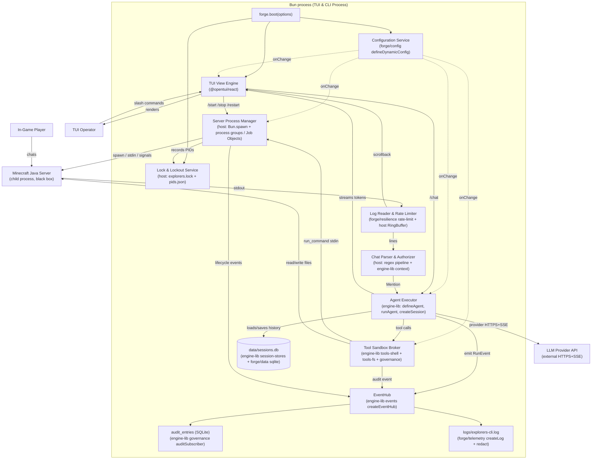

# Design — TUI & CLI Process

> **Implements HLD container**: `TUI & CLI Process` (C4 L2 in `docs/hld/02-architecture.md`).
> **Implements HLD ADRs**: 001, 002, 003, 004, 005, 006, 007, 008 (all eight).

## Overview

The `TUI & CLI Process` is a single Bun process that hosts the terminal UI,
watches `config.yaml`, spawns up to 10 local Minecraft Java child processes,
parses in-game chat for `@alias` agent triggers, runs the LLM agent loop via
`@infinityi/engine-lib`, enforces tool sandboxing via `engine-lib/tools-fs` +
`engine-lib/tools-shell`, persists sessions to a local SQLite WAL database
via `engine-lib/session-stores` + `forge/data/dialects/sqlite`, and emits
structured logs + opt-in telemetry via `forge/telemetry`. It is the only
runnable container under the application's control; the Minecraft Java Server
is a black-box child process and the LLM provider is an external HTTP service.

The container is decomposed into 8 internal components by the HLD (`docs/hld/03-components.md`):
TUI View Engine, Configuration Service, Lock & Lockout Service, Server Process
Manager, Log Reader & Rate Limiter, Chat Parser & Authorizer, Agent Executor,
and Tool Sandbox Broker. This LLD preserves that decomposition — each HLD
component maps to one or more forge/engine-lib imports plus a thin host-owned
adapter. **No infrastructure code is re-implemented.**

---

## Forge-first / engine-lib-first capability mapping

This is the single most important table in the LLD. Every HLD component is
mapped to the exact forge/engine-lib import(s) that satisfy it. Where the
"Host-owned code" column says "none", the library covers it 100%. Where it
lists code, that code is the only non-library code in the container.

| HLD component | Capability needed | forge/engine-lib import | Host-owned code |
|---|---|---|---|
| **TUI View Engine** | React 19 rendering on a terminal grid | `@opentui/react` + `@opentui/core` (already in `package.json`) | One `<App/>` component tree, one `createRoot(renderer).render(...)` call. View-model hooks subscribe to the `forge/config` dynamic handle and to the engine-lib `RunHandle` event stream. |
| **Configuration Service** | Schema-validated, fail-fast config with secret redaction, hot-reload, last-known-good snapshot | `forge/config` → `defineConfig(schema, {sources: defaultSources})` for boot; `defineDynamicConfig(schema, {provider: pollingProvider({intervalMs, fetch: readYaml})})` for hot-reload; `mockConfig` for tests | A `parseYaml` source adapter (Bun has no built-in YAML parser; the project adds `yaml` or `js-yaml` as a peer — implementation choice, not design). A `ConfigSchema` host type built with `t.*` leaves mirroring SRS §6.1. |
| **Lock & Lockout Service** | Single-instance lock + PID registry + stale-PID cleanup | None (no forge primitive for file locks or PID registries — those are application-specific resources) | `Bun.file('data/explorers.lock')` opened with an exclusive lock handle on POSIX (`flock`) and Windows (`LockFileEx`); `data/pids.json` read/written atomically via `Bun.write` + `fs.rename`; on boot, iterate `pids.json` and `process.kill(pid, 0)` to detect stale PIDs, then `taskkill /T /F /PID <pid>` (Windows) or `process.kill(-pid, 'SIGTERM')` (POSIX process group). |
| **Server Process Manager** | Spawn Java child process, pipe stdin/stdout/stderr, exit-code detection, force-kill on timeout, process-group / Job-Object cleanup | None (no forge/engine-lib primitive covers child-process lifecycle — see ADR-LLD-002) | `Bun.spawn({cmd:[javaPath, '-Xmx'+ram+'M', '-jar', jarFile, 'nogui'], stdio:['pipe','pipe','pipe'], detached: process.platform!=='win32'})`; on Windows, attach to a Job Object via `ffi-napi` or native addon (implementation choice); on POSIX, the spawned PID is the group leader so `process.kill(-pid)` kills the tree. |
| **Log Reader & Rate Limiter** | Rate-limit stdout to 5000 lines/s; cap scrollback at 16 MB; drop-oldest ring buffer | `forge/resilience/rate-limit` → `tokenBucketRateLimiter({capacity:5000, refillPerSec:5000})` per server; the `acquire()` call gates each line | A `RingBuffer<LogLine>` with `maxBytes=16*1024*1024`; a `for await (const chunk of child.stdout)` loop that splits on `\n`, calls `limiter.acquire()`, and pushes to the ring buffer; a dropped-counter gauge exposed via `forge/telemetry` meter. |
| **Chat Parser & Authorizer** | Regex match vanilla chat → strip team prefix/suffix → sanitize name → match `@alias` → case-insensitive perm check → rate-limit (rpm + cooldown) → inject N preceding lines | `engine-lib/context` → `staticContext("ingame-window", lines.join("\n"))` for the N-line injection; `forge/resilience/rate-limit` → `slidingWindowRateLimiter({limit:rpm, windowMs:60_000})` keyed per `(playerId, agentId)` for `rpm`; a `Map<string, number>` for cooldown | The regex pipeline itself (no library covers vanilla MC log parsing); a `PlayerRegistry` built from `config.permissions.<serverId>.players` with case-insensitive `Map<lowercaseName, PlayerConfig>`; a `MentionRouter` that emits one `Mention` event per authorized trigger. |
| **Agent Executor** | Provider prompt, load N-history from session, apply timeout, stream tokens to TUI, send chunked `/tellraw` on response | `engine-lib/providers` → `createOpenAI`/`createAnthropic`/`createGoogle`/`createOpenAICompatible` (REST+SSE, retry, timeout — all built in); `engine-lib/agent` → `defineAgent({name, provider, instructions, tools, handoffs?})`; `engine-lib/execution` → `runAgent(agent, {input, session, stream:true, maxSteps, maxHandoffs, context, telemetry, signal})`; `engine-lib/session` → `createSession({id, store})`; `engine-lib/events` → `createEventHub({subscribers:[loggingSubscriber, auditSubscriber, messageBusSubscriber]})`; `engine-lib/resilience` → `circuitBreaker(provider, {failureThreshold, cooldownMs})` if needed; `forge/telemetry` → `initTelemetry({resource, log:{...}, trace:{...}, meter:{...}})` passed as `EngineContext.telemetry` | A `MentionRouter` that translates a server-scoped `Mention` into a `runAgent(...)` call with `session = createSession({id: activeSessionId(serverId, agentId), store})`; offline operator `/chat` uses an ephemeral in-memory session and no in-game delivery. On `RunEvent.run.finish`, Algorithm 6 strips formatting, chunks the response to ≤200 chars, and writes `/tellraw` with `/say` fallback. |
| **Tool Sandbox Broker** | Path canonicalization + containment check; symlink block; NBT-write block when server RUNNING; token-prefix command allowlist; audit log | `engine-lib/tools-shell` → `shellTools({allowedCwds:[server.path], policy:{allow:[...prefixTokens], deny:[...]}, requiresApproval, approve, sandbox: server.state==='running' ? undefined : localSandbox()})` gives `runCommand` + `spawnCommand`; `engine-lib/tools-fs` → `filesystemTools({allowedRoots:[server.path]})` gives `read`, `writeFile`, `editReplace`, `applyPatch` etc.; `engine-lib/governance` → `composePolicies(shellPolicySource(shell), filesystemPolicySource(fs))` for unified run-level policy; `engine-lib/governance` → `auditSubscriber(forgeDataAuditLog({db, table:'audit_entries'}))` for the audit trail | A `ServerStateGate` that flips `engine-lib`'s filesystem policy to read-only when `server.state === 'running'` (rebuilds the policy on hot-reload); a `nbtFileExtension` list (`['.nbt', '.dat', '.mca', '.schem']`) passed as a custom deny-rule. |

**Cross-cutting imports** used by every component:

| Concern | forge/engine-lib import |
|---|---|
| Application lifecycle (boot, ordered start, reverse-stop, readiness, SIGTERM) | `forge/lifecycle` → `forge.boot({components, shutdownTimeout, health:{...}})` + `asComponent(name, hooks)` + `databaseComponent`/`poolComponent`/`httpServerComponent`/`messageBusComponent`/`consumerComponent`/`workerComponent` adapters |
| Structured logging with redaction | `forge/telemetry/log` → `createLog({exporter: stdoutExporter(), level:'info', middleware:[redact({patterns:['api_key','token','password']}), correlation(), serialize()]})` |
| Metrics + traces (opt-in) | `forge/telemetry` → `initTelemetry({resource:{serviceName:'explorers-cli', serviceVersion:'1.0'}, log:{...}, meter:{exporter: telemetry.enabled ? otlpHttpMeterExporter({url}) : nullExporter(), intervalMs:5000}, trace:{exporter: telemetry.enabled ? otlpHttpTraceExporter({url}) : nullExporter()}})` |
| HTTP client (for LLM provider + outbound) | `engine-lib/providers` already wraps `forge/http` via `createProviderHttp` — no direct `forge/http` use needed |
| Resilience pipelines (retry, timeout, circuit breaker) | `forge/resilience` → `combine(retry({maxAttempts:3, backoff:exponentialBackoff({initial:250, max:10_000})}), timeout({ms:agentTimeout}))` for the agent run; `engine-lib/resilience`'s `withProviderRetry` + `circuitBreaker` are layered on top by the provider factories |
| Audit log | `engine-lib/governance` → `auditSubscriber(forgeDataAuditLog({db, table:'audit_entries'}))` |
| Graceful shutdown | `forge/lifecycle` → `installSignalHandlers({onSignal, signals:['SIGTERM','SIGINT'], forceExitOnSecond:true})` returns a disposer; the boot components stop in reverse order |

---

## Responsibilities

### This component owns

- Rendering the terminal UI (server table, log scrollback, chat panel, command line).
- Parsing `config.yaml` and validating it against the SRS §6.1 schema.
- Watching `config.yaml` for hot-reload and applying valid snapshots atomically.
- Acquiring `data/explorers.lock` at boot and releasing it on shutdown.
- Maintaining `data/pids.json` with the PIDs of spawned Java processes.
- On boot, killing stale PIDs from `data/pids.json` before normal operation.
- Spawning, monitoring, and stopping up to 10 Minecraft Java child processes.
- Reading stdout/stderr from each child process, rate-limiting ingestion, and
  maintaining a bounded scrollback buffer.
- Detecting `@alias` mentions in chat log lines and authorizing them against
  `permissions.<serverId>.players`.
- Enforcing per-`(player, agent)` rate limits (`rpm` + `cooldown`).
- Running the LLM agent loop via `engine-lib` and streaming tokens to the TUI.
- Sending agent responses back to the Minecraft server via `/tellraw` stdin writes.
- Registering and enforcing the three agent tools (`run_command`, `read_file`,
  `write_file`) via `engine-lib/tools-shell` + `engine-lib/tools-fs`.
- Persisting sessions (messages + metadata) to `data/sessions.db` (SQLite WAL).
- Pruning sessions older than `EXPLORERS_CLI_SESSION_RETENTION` (default 30 d).
- Writing structured JSON logs to `logs/explorers-cli.log` with 50 MB rotation.
- Writing audit entries (agent tool calls, file ops, `/tellraw` chunks) to the `audit_entries` SQLite table.
- Writing crash reports to `crash-<timestamp>.json` on uncaught exceptions.
- Opt-in telemetry via `forge/telemetry` OTLP exporters (off by default).
- Routing operator slash-commands through a shared command classifier that
  enforces `--read-only` mode.
- Supporting `--validate-config` mode (validate and exit, no side effects).

### This component does NOT own

- Minecraft game logic (owned by the Java child process).
- LLM inference (owned by the external provider).
- Operating-system process scheduling (owned by the host OS).
- Network firewalling / port security (operator's host responsibility).
- Player authentication (the Minecraft server's `online-mode` handles this;
  the manager only authorizes against the configured player list).
- Server log file rotation (the Minecraft server writes its own `logs/` dir;
  the manager does not touch it — NFR-OBS-005).

---

## Architecture

The container is a single Bun process. Internally, the 8 HLD components
communicate via:

- **Direct function calls** for synchronous request/response (e.g. TUI →
  Server Process Manager for `/start`).
- **Async iterables / EventEmitters** for stream-style data (e.g. Log Reader →
  Chat Parser pushes lines via an `async function*`).
- **A host-owned `EventHub`** (from `engine-lib/events`) for fan-out of
  `RunEvent`s to logging, audit, and message-bus subscribers.
- **The `forge/config` dynamic handle's `onChange`** for hot-reload
  notifications to all components that depend on config.
- **The `forge/lifecycle` `Application.stop()`** for graceful shutdown —
  components stop in reverse start order, each `stop()` getting a slice of
  the remaining `shutdownTimeout` budget.



---

## Key algorithms

### Algorithm 1 — Chat mention parsing pipeline

**Computes**: a `Mention` event from a raw stdout line, or `null` if the line
is not a valid authorized mention.

**Inputs**: `line: string`, `serverId: string`, `config: RuntimeConfig`,
`rateLimiterRegistry: Map<string, RateLimiter>`.

**Outputs**: `Mention | null` where `Mention = { serverId, agentId, playerId,
playerName, message, occurredAt }`.

**Pseudocode**:

```
function parseMention(line, serverId, config, rateLimiterRegistry):
    # Step 1: vanilla chat-line regex (SRS FR-CHAT-001, ADR-006)
    m = CHAT_LINE_REGEX.match(line)
    if not m: return null

    rawPlayer = m.group("player")
    message = m.group("message")

    # Step 2: strip configurable team prefix/suffix (FR-CHAT-005, per player)
    playerDecoration = config.permissions[serverId].findDecorationFor(rawPlayer)
    if playerDecoration.teamPrefix and rawPlayer.startsWith(playerDecoration.teamPrefix):
        rawPlayer = rawPlayer.slice(playerDecoration.teamPrefix.length)
    if playerDecoration.teamSuffix and rawPlayer.endsWith(playerDecoration.teamSuffix):
        rawPlayer = rawPlayer.slice(0, -playerDecoration.teamSuffix.length)

    # Step 3: sanitize player name (FR-CHAT-006 / NFR-SEC-006)
    if not NAME_REGEX.match(rawPlayer): return null   # ^[a-zA-Z0-9_]{1,16}$
    playerName = rawPlayer

    # Step 4: find first matching @alias (FR-CHAT-004)
    alias = findFirstAlias(message, config.agentsByAlias)
    if alias is null: return null
    agent = config.agentsByAlias[alias]

    # Step 5: case-insensitive permission check (FR-CHAT-007 / FR-CHAT-008 / NFR-SEC-005)
    player = config.permissions[serverId].playersByLowercaseName[playerName.toLowerCase()]
    if player is null: return null   # deny-by-default
    if alias not in player.allowedAgents: return null

    # Step 6: rate limit (FR-CHAT-009 / FR-CHAT-010)
    key = serverId + ":" + agent.id + ":" + playerName.toLowerCase()
    rl = rateLimiterRegistry.get(key) or createLimiter(agent.rpm, agent.cooldown)
    if not rl.acquire(): return null   # silently ignored

    # Step 7: success
    return Mention {
        serverId, agentId: agent.id, playerId: playerName, playerName,
        message: message.slice(alias.length + 1),  # strip "@alias "
        occurredAt: now()
    }
```

**Complexity**: O(line length) for the regex; O(1) for map lookups; O(1) for
the rate limiter (sliding-window ring buffer). Per-line cost is dominated by
the regex, which is compiled once at boot.

**Edge cases**:
- Line is a server log message (not chat) — Step 1 rejects it.
- Player name has team prefix/suffix — Step 2 strips them.
- Multiple `@alias` mentions in one message — Step 4 picks the first (FR-CHAT-004).
- Player is authorized for some agents but not this one — Step 5 denies.
- Rate-limited — Step 6 denies silently (FR-CHAT-010).
- `!help` trigger — handled by a separate regex (not shown); produces a
  `/tellraw` listing permitted agents, no LLM call.

### Algorithm 2 — Server start sequence

**Computes**: a server state transition `STOPPED → STARTING → RUNNING` (or
`→ FAILED`), spawning a Java child process.

**Inputs**: `serverId: string`, `config: RuntimeConfig`, `pidRegistry: PidRegistry`.

**Outputs**: `Promise<StartResult>` where `StartResult = { ok: true, pid: number } | { ok: false, code: 'PORT_CONFLICT' | 'JAR_NOT_FOUND' | 'PATH_TRAVERSAL_BLOCKED' | 'STARTUP_TIMEOUT' | 'ALREADY_RUNNING' }`.

**Pseudocode**:

```
async function startServer(serverId, config, pidRegistry):
    server = config.servers[serverId]
    if server is undefined: return { ok:false, code:'SERVER_NOT_FOUND' }  # internal

    # State guard (FR-SRV-001)
    if serverState[serverId] in (RUNNING, STARTING): return { ok:false, code:'ALREADY_RUNNING' }

    # NFR-SEC-002: jarFile must resolve inside canonical server.path
    canonicalRoot = await realpath(server.path)
    canonicalJar = await realpath(join(server.path, server.jarFile))
    if not canonicalJar.startsWith(canonicalRoot + sep): return { ok:false, code:'PATH_TRAVERSAL_BLOCKED' }
    if not await fileExists(canonicalJar): return { ok:false, code:'JAR_NOT_FOUND' }

    # NFR-SEC-004: javaPath must exist and be executable (not constrained to server.path)
    if not await isExecutable(server.javaPath): return { ok:false, code:'JAVA_NOT_FOUND' }

    # FR-SRV-008: check port availability via TCP bind (no RCON)
    if not await isPortFree(server.serverPort, timeoutMs=1000): return { ok:false, code:'PORT_CONFLICT' }

    # FR-SRV-001: spawn with Bun.spawn
    serverState[serverId] = STARTING
    child = Bun.spawn({
        cmd: [server.javaPath, '-Xmx' + server.ram + 'M', '-Xms' + server.ram + 'M',
              '-jar', server.jarFile, 'nogui'],
        cwd: server.path,
        stdio: ['pipe', 'pipe', 'pipe'],
        detached: process.platform !== 'win32',   # POSIX process group leader
        env: { ...process.env, JAVA_TOOL_OPTIONS: undefined }
    })

    # FR-SRV-018 / NFR-REL-003: record PID immediately
    pidRegistry.set(serverId, child.pid)
    await pidRegistry.flush()

    # Wire stdout to Log Reader & Rate Limiter (Algorithm 3)
    logReader.attach(serverId, child.stdout)

    # FR-SRV-010: startup timeout
    startupTimer = setTimeout(() => {
        if serverState[serverId] == STARTING:
            forceKillChildTree(child)
            serverState[serverId] = FAILED
    }, server.startupTimeout * 1000)

    # NFR-REL-005: detect "Done!" line on stdout within timeout
    child.stdout.on('line', (line) => {
        if line.includes('Done (') and line.includes(')! For help, type "help"'):
            clearTimeout(startupTimer)
            serverState[serverId] = RUNNING
            runtimeState[serverId].startTime = now()
            runtimeState[serverId].lastSuccessfulStart = now()
            runtimeState[serverId].lastError = null
    })

    # FR-SRV-014: non-zero exit within 2 s sets state FAILED
    child.exited.then((code) => {
        clearTimeout(startupTimer)
        if serverState[serverId] != STOPPED:   # not a graceful stop
            serverState[serverId] = FAILED
            runtimeState[serverId].lastError = 'process exited with code ' + code
        pidRegistry.delete(serverId)
    })

    child.stdin.on('close', () => {
        if serverState[serverId] == RUNNING:
            serverState[serverId] = FAILED
            runtimeState[serverId].lastError = 'stdin closed unexpectedly'
            auditLog.append({actionType:'stdin_closed', serverId, outcome:'failed'})
    })

    return { ok: true, pid: child.pid }
```

**Graceful stop transition**:

```
async function stopServer(serverId, force):
    child = childRegistry[serverId]
    if child is undefined or serverState[serverId] == STOPPED:
        return { ok:false, code:'NOT_RUNNING' }
    serverState[serverId] = STOPPING
    if not force:
        child.stdin.write('/stop\n')
    await Promise.race([child.exited, sleep(server.stopTimeout * 1000)])
    if child still running:
        forceKillChildTree(child)
    serverState[serverId] = STOPPED
    runtimeState[serverId].pid = null
```

**Edge cases**:
- `server.path` is a symlink to outside the operator's home — `realpath`
  resolves it; the containment check uses the resolved path.
- Port is bound by another process (including a previous crashed server) —
  Step "check port availability" fails fast with `PORT_CONFLICT`.
- Java exits before printing "Done!" — `child.exited` fires, state → `FAILED`.
- Operator issues `/stop` during `STARTING` — `forceKillChildTree` is called;
  state goes `STARTING → STOPPED` (not `FAILED`, because the operator
  initiated it).

### Algorithm 3 — Bounded log ingestion

**Computes**: pushes a line into a per-server ring buffer, dropping lines that
exceed the rate limit or the buffer cap.

**Inputs**: `serverId: string`, `line: string`, `ringBuffer: RingBuffer<LogLine>`,
`rateLimiter: RateLimiter` (from `forge/resilience/rate-limit`).

**Pseudocode**:

```
async function ingestLine(serverId, line, ringBuffer, rateLimiter):
    # NFR-PERF-004: rate limit
    acquired = await rateLimiter.tryAcquire()
    if not acquired:
        droppedCounter[serverId].increment()
        return   # silently dropped; full log still on disk at server.path/logs/latest.log

    # NFR-REL-006: buffer cap
    entry = LogLine { serverId, text: line, ts: now() }
    if ringBuffer.bytesUsed + entry.byteLength > ringBuffer.maxBytes:
        # drop oldest until we have room
        while ringBuffer.bytesUsed + entry.byteLength > ringBuffer.maxBytes:
            ringBuffer.shiftOldest()
            evictedCounter[serverId].increment()
    ringBuffer.push(entry)

    # Forward to chat parser (Algorithm 1) and TUI scrollback
    chatParser.parse(serverId, line)
    tui.scrollback.push(serverId, entry)
```

**Complexity**: O(1) per line for the rate limiter (token bucket) and the ring
buffer (head/tail indices). The `while` loop for eviction is amortized O(1)
because each evicted byte is evicted at most once.

### Algorithm 4 — Hot-reload validation + atomic publish

**Computes**: validates a candidate config snapshot, and if valid, atomically
swaps the live config handle; otherwise retains the last known good snapshot
and emits a TUI warning.

**Inputs**: `candidateYaml: string`, `current: RuntimeConfig`,
`schema: ConfigSchema`.

**Outputs**: `{ ok: true, next: RuntimeConfig, changedKeys: string[] } |
{ ok: false, issues: SchemaIssue[], kept: RuntimeConfig }`.

**Pseudocode**:

```
async function tryReload(candidateYaml, current, schema):
    # Parse + validate against the same schema used at boot
    candidate = defineConfig(schema, {
        sources: [staticProvider(parseYaml(candidateYaml))],
        throwOnError: true,
        redactReceived: true,
    }).tryResolve()

    if candidate is SchemaValidationError:
        return { ok:false, issues: candidate.issues, kept: current }

    # NFR-CAP-001: server count cap
    if Object.keys(candidate.servers).length > 10:
        return { ok:false, issues:[{path:'servers', message:'too many servers'}], kept: current }

    # NFR-REL-007: do not remove a running server from the active set
    for sid in Object.keys(current.servers):
        if sid not in candidate.servers and serverState[sid] in (RUNNING, STARTING):
            return { ok:false, issues:[{path:'servers', message:'cannot remove running server '+sid}], kept: current }

    # NFR-PERF-002: 2 s budget — validated, permission-index rebuilt, notifications published
    # FR-HOT-009: process-affecting fields apply only on next restart.
    APPLY_NOW = ['agents', 'providers', 'permissions', 'featureFlags', 'servers.*.name']
    APPLY_ON_RESTART = ['servers.*.serverPort', 'servers.*.ram', 'servers.*.jarFile', 'servers.*.javaPath', 'servers.*.startupTimeout']
    pendingRestart = diff(current, candidate).filter(matches(APPLY_ON_RESTART) and serverState[serverId] in (RUNNING, STARTING))
    changedKeys = diff(current, candidate)
    dynamicHandle.publish(candidate)   # atomic swap under the hood
    permissionIndex.rebuild(candidate)
    tui.setPendingRestart(pendingRestart)
    notifyComponents(changedKeys)

    return { ok:true, next: candidate, changedKeys }
```

**Edge cases**:
- `config.yaml` deleted mid-edit — `tryReload` catches the file-missing error
  and returns `{ ok:false, kept: current }` without touching state.
- Editor atomic-save (write-to-temp + rename) — the file watcher fires twice
  (once for temp deletion, once for rename); the second call succeeds.
- New server added while another is starting — the new server is registered
  but the starting one is untouched.
- Running server removed from config — rejected (cannot remove running
  server); operator must `/stop` it first.

### Algorithm 5 — Read-only mode enforcement

**Computes**: classifies an operator command as mutating or non-mutating, and
rejects mutating commands when `runtimeMode === 'read-only'`.

**Inputs**: `command: ParsedCommand`, `runtimeMode: 'normal' | 'read-only'`.

**Outputs**: `{ allowed: true } | { allowed: false, reason: 'READ_ONLY_BLOCKED' }`.

**Pseudocode** (the full classification table is in ADR-LLD-003):

```
function classifyCommand(command, runtimeMode):
    if runtimeMode == 'normal': return { allowed: true }

    if command.kind in MUTATING_COMMANDS:
        return { allowed: false, reason: 'READ_ONLY_BLOCKED' }

    return { allowed: true }

# MUTATING_COMMANDS = {
#   'start', 'stop', 'restart',
#   'chat',                 # /chat sends an LLM prompt
#   'send-stdin',           # raw stdin to MC server
#   'clear-session',        # /clear wipes session cache
#   'config-edit',          # TUI config editor save
# }
# NON-MUTATING (allowed in read-only):
#   'help', 'session-list', 'session-resume-view', 'log-view',
#   'config-view', 'navigate', 'quit'
```

### Algorithm 6 — In-game response delivery pipeline

**Computes**: zero or more `/tellraw` chunks sent to the Minecraft server's
stdin, with `/say` fallback on individual chunk failure.

**Inputs**: `response: string`, `serverId: string`, `agentId: string`,
`runId: string`, `server: Server`.

**Outputs**: `{ ok: true, chunksDelivered: number }` or
`{ ok: false, code: 'OFFLINE_FAIL' | 'CHUNK_SPLIT_FAILED' }`.

**Pseudocode**:

```
async function deliverInGame(response, serverId, agentId, runId, server, auditLog):
    if server.state !== RUNNING:
        auditLog.append({actionType:'tellraw_skipped', serverId, agentId, runId, outcome:'blocked', detail:'server_offline'})
        return { ok:false, code:'OFFLINE_FAIL' }

    # FR-INV-008: strip Minecraft formatting markers.
    sanitized = response.replace(/[§&][0-9a-fk-orx]/g, '')
    chunks = splitIntoChunks(sanitized, {maxChunkSize: 200, preferBoundaries:['sentence','clause','word']})
    if chunks.length == 0:
        return { ok:false, code:'CHUNK_SPLIT_FAILED' }

    for i in 0..chunks.length-1:
        chunk = chunks[i]
        tellrawJson = JSON.stringify({text: chunk})
        ok = await serverMgr.sendCommand(serverId, 'tellraw @a ' + tellrawJson)
        if not ok:
            await serverMgr.sendCommand(serverId, 'say ' + chunk.replace(/ /g, '_'))
            auditLog.append({actionType:'say_fallback', serverId, agentId, runId, outcome:'ok', detail:'chunkIndex='+i})
        else:
            auditLog.append({actionType:'tellraw_sent', serverId, agentId, runId, outcome:'ok', detail:'chunkIndex='+i+', length='+chunk.length})
        if i < chunks.length - 1:
            await sleep(500)

    return { ok:true, chunksDelivered: chunks.length }
```

`splitIntoChunks` prefers sentence boundaries (`. `, `! `, `? `), then clause
boundaries (`; `, `, `, `: `), then whitespace word boundaries. Only a single
word longer than 200 characters is hard-split.

---

## Concurrency model

The container is a single Bun process. Bun's event loop is single-threaded;
all components cooperate via `async`/`await` and `AsyncIterable`. There are
no worker threads in v1.

**Per-server pipelines**: each spawned Minecraft server has its own
`for await (const chunk of child.stdout)` loop. These loops run concurrently
on the event loop. The Log Reader & Rate Limiter owns one
`forge/resilience/rate-limit` `tokenBucketRateLimiter` per server, so a flood
on server A does not consume server B's token budget.

**Per-agent rate limiting**: a `Map<string, RateLimiter>` keyed by
`(serverId, agentId, playerName.toLowerCase())`. Each limiter is a
`forge/resilience/rate-limit` `slidingWindowRateLimiter({limit:rpm,
windowMs:60_000})`. Cooldown is enforced by a separate
`Map<string, number>` (last-invoked timestamp); both maps are mutated under
the event loop's single-threaded guarantee — no mutex needed.

**Session writes**: the `engine-lib/session-stores` SQLite store uses WAL mode
(ADR-002). Concurrent appends from multiple agent runs on different
`(serverId, agentId)` keys are serialized by SQLite's writer lock; readers do
not block. The store's `appendIfVersion` (CAS) capability is opt-in and not
needed in v1 because the manager is single-process.

**Operator command concurrency**: slash-commands are processed serially by a
host-owned `CommandRouter` (an `async` queue). Two `/start` commands for the
same server in quick succession are deduped by the idempotency layer (see
`idempotency.md`).

**Tool execution concurrency**: within a single `runAgent` call, the
`engine-lib/execution` loop dispatches tool calls in parallel with per-call
error isolation. Multiple `runAgent` calls (from different players on
different servers) run concurrently on the event loop; each call has its own
`RunHandle` and its own `Session`.

**Shutdown ordering**: `forge/lifecycle`'s `Application.stop()` stops
components in reverse start order. The start order is:

1. `forge/telemetry` (logs first, so the rest can log their own startup)
2. `forge/config` (so components can read config)
3. Lock & Lockout Service (so we hold `explorers.lock` before touching files)
4. SQLite session store (`forge/data` dialect)
5. Server Process Manager (no servers spawned yet — just initialized)
6. Agent Executor (engine-lib provider clients)
7. TUI View Engine (last, so the user sees the running state)

Stop is the reverse. Each `stop()` gets a slice of the remaining
`shutdownTimeout` budget (default 30 s); overruns are abandoned (logged, not
thrown) so one bad component can't block the process.

---

## Caching

| Cache | Where | TTL | Invalidation | Why |
|---|---|---|---|---|
| Canonicalized `server.path` | `Map<serverId, string>` in Server Process Manager | Until hot-reload changes `server.path` | Hot-reload `onChange` clears the entry | `realpath()` is a syscall; cache to avoid repeated calls (ADR-004 mitigation). |
| Permission index (`Map<serverId, Map<lowercaseName, PlayerConfig>>`) | In-memory, rebuilt on hot-reload | Until hot-reload | `tryReload` calls `permissionIndex.rebuild(candidate)` | Avoids per-mention O(N) scan of the player list. |
| `forge/config` dynamic snapshot | The `DynamicConfigHandle.values` proxy | Live (always latest validated snapshot) | Atomic swap on successful reload | The single source of truth for runtime config. |
| Agent definitions (`Map<agentId, AgentDefinition>`) | In-memory | Until hot-reload changes `agents` block | Hot-reload rebuilds the map; in-flight `runAgent` calls finish with the old definition | Avoids re-creating provider clients on every mention. |
| Provider clients (`Map<providerName, Provider>`) | In-memory | Until hot-reload changes provider config | Hot-reload rebuilds only changed providers | Provider clients hold an HTTP connection pool; reuse them. |
| Session handles (`Map<sessionKey, Session>`) | In-memory | Until LRU eviction (capacity 100) | LRU; on evict, `session.flush()` is awaited | Avoids re-opening the SQLite row on every mention. |

No Redis, no external cache. The LRU is a plain `Map` (insertion-order
iterating) with manual delete-oldest on capacity overflow.

---

## External dependencies

| External system | Used for | Failure mode | Mitigation |
|---|---|---|---|
| `bun:sqlite` (via `forge/data/dialects/sqlite`) | Session persistence | Filesystem corruption, disk full | WAL mode + 24-hour prune; on `SQLITE_FULL`, log and reject new sessions (existing ones keep serving from cache until evicted). |
| Minecraft Java Server (child process) | Game world, chat protocol, stdin command receiver | Crash, hang, runaway log flood | `Bun.spawn` exit listener → state `FAILED` within 2 s (NFR-REL-005); log rate limiter (ADR-005) bounds ingestion; PID registry + stale-PID cleanup on boot. |
| LLM Provider API (OpenAI/Anthropic/Google/compatible) | Token generation | 4xx (auth, quota), 5xx, network timeout, SSE stream drop | `engine-lib/providers` default resilience (`retry maxAttempts:3`, exponential backoff, `timeout ms:60_000`); `engine-lib/resilience` `circuitBreaker(provider, {failureThreshold, cooldownMs})` if the operator enables it; on stream drop, `runAgent` finishes the `RunHandle.completed` with a `ProviderError` and the TUI shows "Provider stream interrupted". |
| `config.yaml` (filesystem) | Configuration | Deleted, malformed, atomic-rename race | `tryReload` (Algorithm 4) retains last known good snapshot; file watcher has a 200 ms debounce to coalesce editor saves. |
| Host OS process table | PID allocation, signal delivery | PID reuse (a stale PID in `pids.json` now belongs to a different process) | On boot, before killing a stale PID, verify the process command line contains `java` and `jar` (Bun `Bun.spawn` introspection or `ps -p <pid> -o command=` on POSIX, `wmic process where processid=<pid> get commandline` on Windows). If verification fails, log and skip — do not kill an unrelated process. |
| `@opentui/react` terminal | Rendering | Terminal resize, color support mismatch | OpenTUI handles resize natively; the `<App/>` tree uses `flexGrow` so layout reflows. |
| `forge/telemetry` OTLP exporter (opt-in) | Metrics + traces | OTLP endpoint down | `forge/telemetry`'s `flush`/`shutdown` never throw; exporter errors are isolated and logged once to stderr. No impact on the manager's core loops. |

---

## Stack notes

> Stack choices are inferred from the SRS, HLD ADRs, and `package.json`. See
> `README.md` "Stack inference" for the full table. The following callouts
> capture non-obvious stack-specific decisions.

> **Stack note — YAML parsing**: Bun does not ship a YAML parser. The
> Configuration Service will use the `yaml` npm package (peer dependency) to
> parse `config.yaml` into a JS object, then feed that object to
> `forge/config` via a `staticProvider({snapshot})` source. This is an
> implementation choice; the LLD treats YAML parsing as a host-owned adapter.

> **Stack note — Windows Job Objects**: `Bun.spawn` does not expose Windows
> Job Object APIs. To bind a child process's lifetime to the manager's, the
> Server Process Manager uses a small native addon (or `ffi-napi`) to call
> `CreateJobObject` + `AssignProcessToJobObject` +
> `SetInformationJobObject(JobObjectExtendedLimitInformation,
> JOB_OBJECT_LIMIT_KILL_ON_JOB_CLOSE)`. This is the only native code in the
> container. ADR-LLD-002 documents the decision and the fallback
> (`taskkill /T /F /PID` on stale-PID recovery).

> **Stack note — engine-lib session store**: `engine-lib/session-stores` ships
> `createSqliteSessionStore` built on `forge/data/dialects/sqlite`. The store
> already handles WAL mode, indexes on `(serverId, agentId)`, `(timestamp)`,
> and `(sessionId)`, and the v3 schema migration. The LLD does NOT define a
> custom session table — see `data-model.md`.

> **Stack note — engine-lib tool packs**: `engine-lib/tools-shell`'s
> `shellTools()` returns `{runCommand, spawnCommand}`. The HLD's
> `run_command` tool maps to `runCommand`. `engine-lib/tools-fs`'s
> `filesystemTools()` returns 12 tools; the HLD's `read_file` and
> `write_file` map to the `read` and `writeFile` tools. The other 10
> (`editReplace`, `editRange`, `applyPatch`, `findFiles`, `searchText`,
> `searchSemantic`, `symbols`, `repoMap`, `openWindow`, `diffStatus`) are
> registered but not advertised in the HLD's v1 tool surface — they are
> available for power-user agents but not required.
