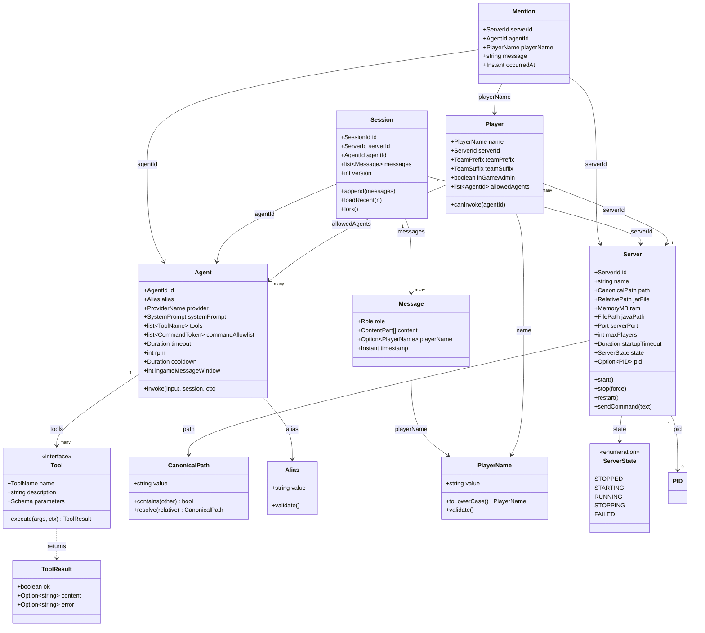

# Domain Class Diagram — TUI & CLI Process

> **Implements HLD**: `docs/hld/04-data-model.md` (conceptual ER).

The class diagram below shows the **core domain types** of the `TUI & CLI
Process` container: the entities, value objects, and aggregates that appear
in the API contracts and the data model. It deliberately skips controllers,
repositories, services that are pass-throughs, DTOs (in `openapi.yaml`), and
framework classes (`@opentui/react` components, `forge/lifecycle`
adapters).

---

## Per-type description

### `Server` (entity, aggregate root)

A configured Minecraft Java server instance. Identity is `ServerId`
(`^[a-zA-Z0-9_-]{1,32}$`, FR-CFG-005). The aggregate root for `PID` (the OS
process ID of the spawned Java child, if any) and for the per-server
`CanonicalPath` (the sandbox root, used by the Tool Sandbox Broker).

**State machine**: `STOPPED → STARTING → RUNNING` (happy path) or
`STARTING → FAILED` (startup failure) or `RUNNING → FAILED` (crash) or
`RUNNING → STOPPING → STOPPED` (graceful stop). `FAILED` is recoverable via `/restart`.

**Invariants**:

- `jarFile` MUST resolve inside `path` after canonicalization (NFR-SEC-002).
- `state === RUNNING` implies `pid` is present and the child process is alive.
- `state === STOPPED` implies `pid` is `None`.

**Key methods**:

- `start()` — Algorithm 2 in `design.md`. Spawns via `Bun.spawn`, records
  PID, sets up startup timeout.
- `stop(force)` — Sends `/stop` to stdin, waits for exit, force-kills on
  timeout. Updates state and PID registry.
- `restart()` — Sequential `stop(false)` then `start()`.
- `sendCommand(text)` — Writes `text + '\n'` to the child's stdin (used by
  `/tellraw` and by the `run_command` tool).

### `Agent` (entity)

A configured LLM agent persona. Identity is `AgentId`
(`^[a-zA-Z0-9_-]{1,32}$`). Has an `Alias` (the `@alias` trigger) and a
reference to a `ProviderName` (resolved to a `Provider` at runtime via the
provider registry).

**Invariants**:

- `alias` MUST match `^[a-zA-Z0-9_-]{2,}$` and be unique across active config.
- `commandAllowlist` tokens MUST be exact prefix tokens (e.g. `whitelist add`,
  not `whitelist`).
- `rpm >= 1` and `cooldown >= 0`.

**Key method**: `invoke(input, session, ctx)` — calls `engine-lib`'s
`runAgent(this, {input, session, stream:true, ...ctx})` and returns the
`RunHandle`.

### `Player` (entity)

A player authorized to invoke agents on a specific server. Identity is
`(serverId, playerName)` — the same player name on different servers is a
different `Player` (per SRS §4.6).

**Invariants**:

- `name` matches `^[a-zA-Z0-9_]{1,16}$` (NFR-SEC-006).
- Comparisons against incoming chat names are case-insensitive (NFR-SEC-005).

**Key method**: `canInvoke(agentId)` — returns `true` iff `agentId` is in
`allowedAgents`.

### `Session` (entity, aggregate root)

A conversation history scoped to `(serverId, agentId)`. The aggregate root
for `Message` rows. The `SessionId` is the composite
`serverId:agentId:<timestamp>-<randomSuffix>` (ADR-LLD-004, FR-SES-006) — all
players on a given server who mention a given agent share the active session
for that `(serverId, agentId)` prefix.

**Invariants**:

- `messages` are append-only (no updates, no deletes within a session;
  pruning happens via a separate job).
- `version` increments on every append (engine-lib CAS).

**Key methods**:

- `append(messages)` — delegates to `SessionStore.append`.
- `loadRecent(n)` — fetches the last N messages (used for the
  `ingameMessageWindow` context injection, FR-CHAT-011).
- `fork()` — creates a new session with a prefix of this session's messages
  (snapped to a turn boundary). Used for branching conversations.

### `Mention` (value object)

An immutable record of an authorized in-game mention. Produced by the Chat
Parser (Algorithm 1 in `design.md`). Contains everything the Agent Executor
needs to invoke the agent: which server, which agent, which player, what
message, when.

**Invariants**: all fields are non-null; `message` has the `@alias ` prefix
stripped.

### `Tool` (interface)

The contract for an agent tool. Implemented by `engine-lib/tools-shell`'s
`runCommand`/`spawnCommand` and `engine-lib/tools-fs`'s `read`/`writeFile`/
etc. The host code does NOT implement this interface directly — it consumes
the implementations provided by engine-lib.

**Key method**: `execute(args, ctx)` — returns `ToolResult`. Implementations
MUST return `{ok:false, error}` for recoverable domain failures and throw
only for unexpected implementation faults (engine-lib's run loop isolates
both).

### `CanonicalPath` (value object)

A filesystem path that has been `realpath`-resolved (no symlinks, no `..`).
The basis for sandbox containment checks (ADR-004). Two `CanonicalPath`s are
equal iff their string values are equal.

**Invariants**: `value` is an absolute path with no symbolic links.

**Key methods**:

- `contains(other)` — true iff `other.value` starts with `this.value +
separator`. Used by the Tool Sandbox Broker.
- `resolve(relative)` — joins and canonicalizes; returns a new
  `CanonicalPath`. Throws if the result escapes the root (defensive).

### `Alias`, `PlayerName`, `FilePath`, `MemoryMB`, `Port`, `Duration`, `Instant` (value objects)

Type-safe wrappers around primitives. Each validates its invariant on
construction (e.g. `PlayerName('Steve!')` throws because `!` is not in
`[a-zA-Z0-9_]`). These exist to prevent stringly-typed bugs at the domain
boundary.

### `ServerState` (enumeration)

The five lifecycle states of a `Server`. See the state machine note on
`Server` above.

### `ToolResult` (value object)

The result of a tool execution. Discriminated on `ok`. When `ok: true`,
`content` is the success payload (string). When `ok: false`, `error` is a
recoverable domain error message. This is the engine-lib stable contract.

### `Message` (entity)

A single conversation turn within a `Session`. The role is one of `user`,
`assistant`, `system`, `tool` (engine-lib's `Role` type). The content is an
array of `ContentPart`s (text, image, tool call, tool result) — but for
explorers-cli v1, only `TextPart` and `ToolResultPart` are used.

---

## Aggregate boundaries

- **`Server`** is an aggregate root. `PID` is a child (cannot exist without
  the server). `CanonicalPath` is a value object that describes the server,
  not a child entity.
- **`Agent`** is an aggregate root. It does NOT own `Tool` instances — it
  references them by name, and the `ToolRegistry` (engine-lib) holds the
  actual `ToolDefinition` objects. This keeps agents serializable in
  `config.yaml` without dragging in tool implementations.
- **`Player`** is an aggregate root scoped to `(serverId, playerName)`. It
  references `Agent` and `Server` by ID, not by object reference.
- **`Session`** is an aggregate root. `Message` is a child (cannot exist
  without the session). Cross-session references are by `SessionId`, never
  by object.

---

## Notes on what's NOT here

Per the skill reference's `class-diagrams.md`, the following are
deliberately skipped:

- **TUI View Engine components** (`<App/>`, `<ServerPanel/>`, `<ChatPanel/>`,
  etc.) — framework plumbing, not domain.
- **`CommandRouter`** — framework plumbing.
- **`ConfigurationService`** — framework plumbing (wraps `forge/config`).
- **`Lock & Lockout Service`** — operational, not domain.
- **`Server Process Manager`** — operational, not domain (orchestrates
  `Server` entities but adds no domain logic).
- **`Log Reader & Rate Limiter`** — operational.
- **`Chat Parser & Authorizer`** — operational (produces `Mention` value
  objects but doesn't own domain state).
- **`Agent Executor`** — operational (orchestrates `Agent` and `Session`
  entities but adds no domain logic beyond what `engine-lib`'s `runAgent`
  already provides).
- **`Tool Sandbox Broker`** — operational (wraps `engine-lib`'s tool packs).
- **`SessionStore`, `AuditLog`, `EventHub`, `RateLimiter`** — these are
  engine-lib/forge interfaces, not domain types. They appear in `design.md`'s
  capability mapping.
- **DTOs** (`StartServerRequest`, `OperatorChatRequest`, etc.) — in
  `openapi.yaml`. Where a DTO mirrors an entity 1:1 (e.g. `StartServerRequest`
  is just `{serverId}`), the entity is the source of truth.
- **Mappers, validators, factories** — implementation helpers, not design.
