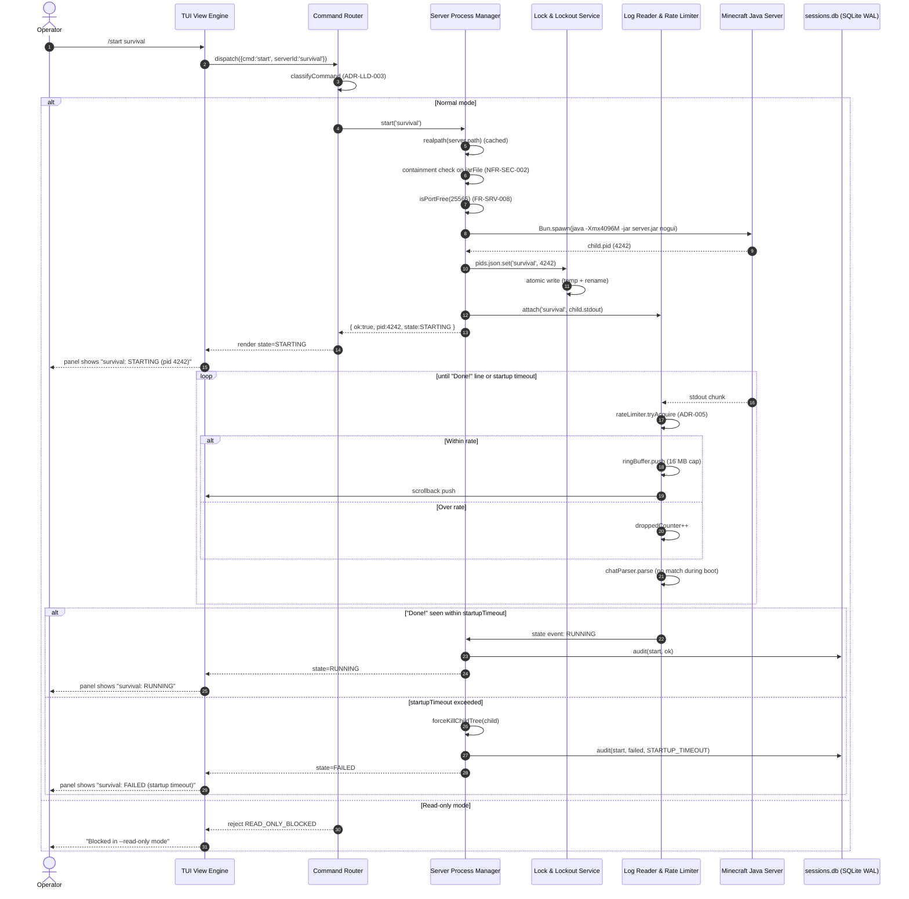
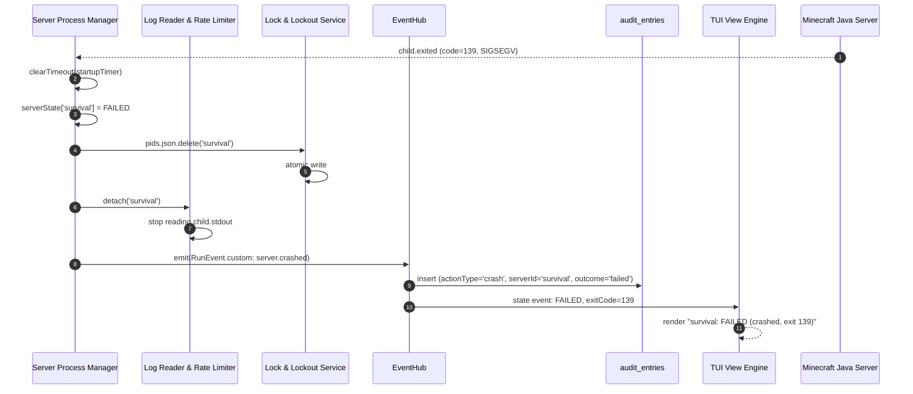
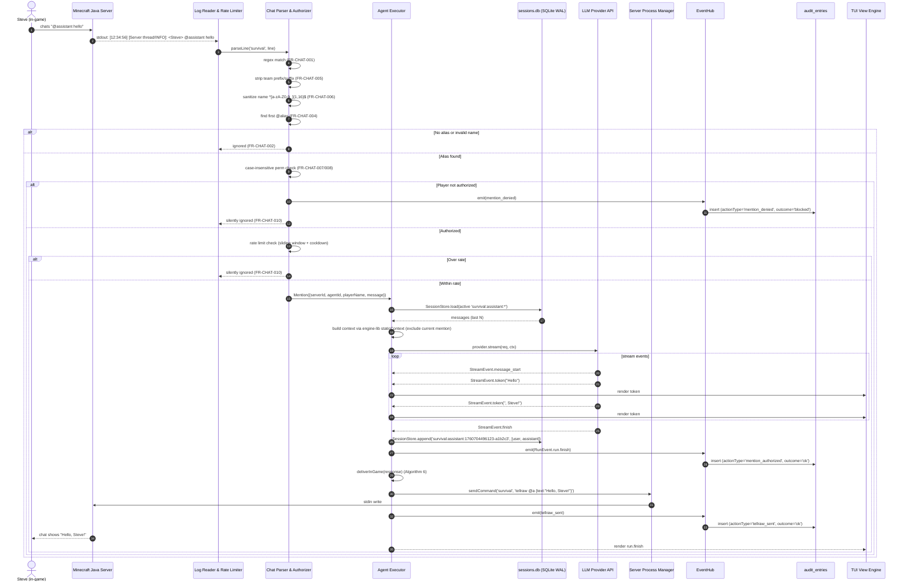
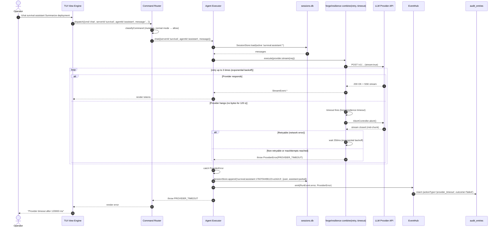
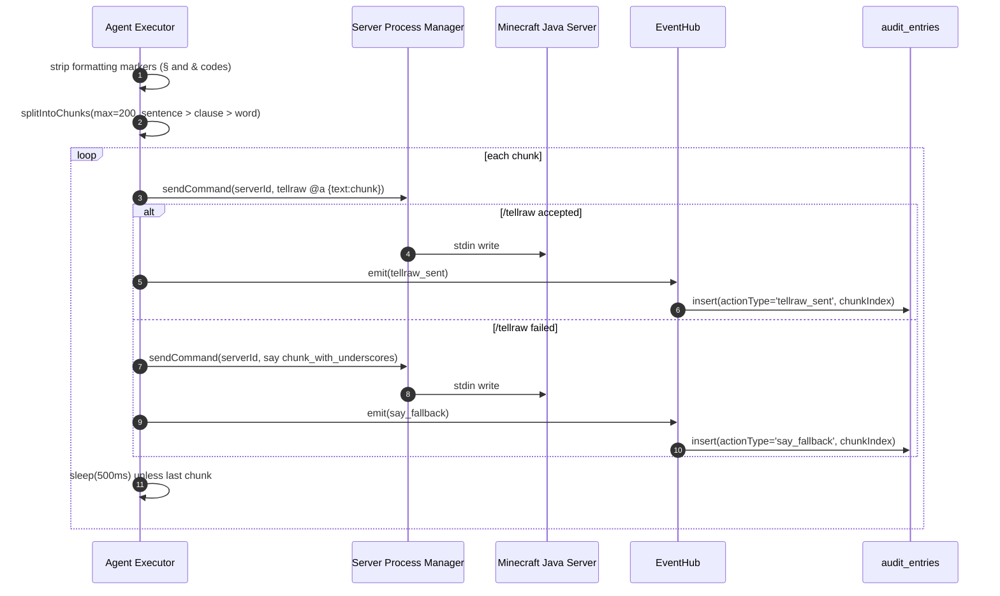
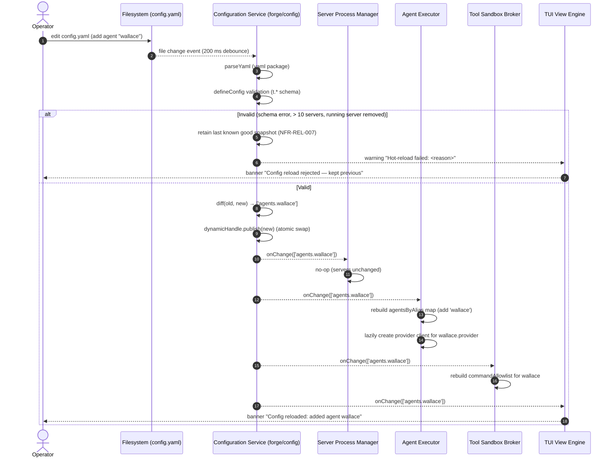
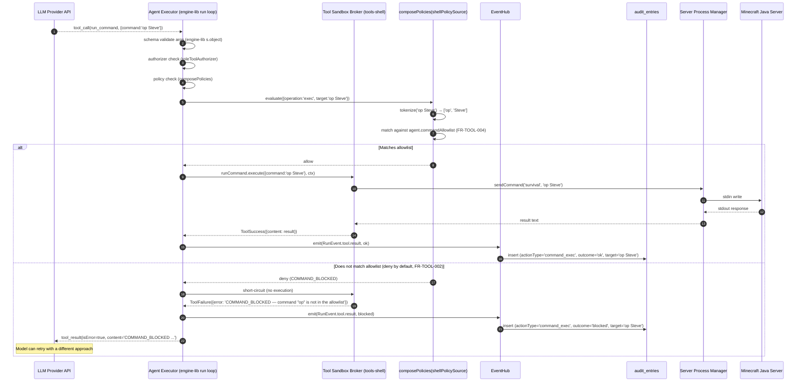
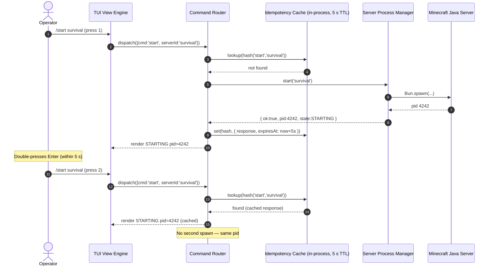
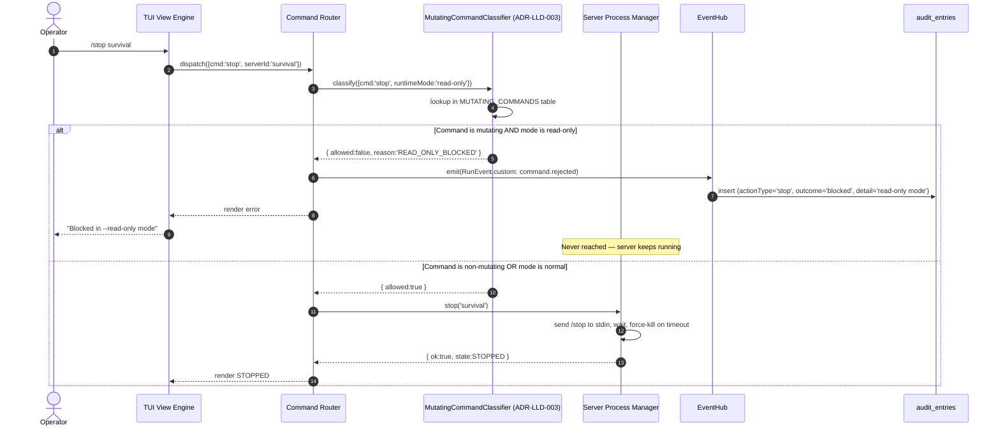

# Sequence Diagrams — TUI & CLI Process

> **Implements HLD ADRs**: 001 (REST+SSE), 002 (SQLite WAL), 003 (Bun.spawn),
> 004 (sandbox), 005 (bounded log ingestion), 006 (chat parser), 007
> (observability), 008 (runtime mode + hot-reload).

Eight critical flows are documented below. Each diagram references real
participants from the HLD L2 view (no invented external systems). Per the
skill reference's `sequence-diagrams.md`, each includes explicit
participants, specific message labels, alt blocks for branching, loop blocks
for retries, and notes for non-obvious decisions.

---

## 1. Operator `/start` — happy path

The operator types `/start survival` in the TUI command line. The Command
Router validates the command, the Server Process Manager spawns the Java
child process, the Log Reader attaches to stdout, and the TUI shows state
`STARTING` → `RUNNING`.



**Notes**:
- The PID is recorded in `pids.json` **before** the startup timeout timer is
  set, so a crash during startup still leaves a recoverable PID entry
  (NFR-REL-002).
- The audit write is async — the TUI does not wait for it.
- The Chat Parser runs on every line but only matches chat lines; during
  server boot, no chat lines are emitted.

---

## 2. Server crash detection and cleanup

A running Minecraft server crashes (JVM segfault). The Bun exit listener
fires within 2 s (NFR-REL-005), the state goes `RUNNING → FAILED`, the PID is
removed from `pids.json`, and the TUI shows the failure.



**Notes**:
- The state transition happens **before** the audit write, so even if the
  audit write fails (e.g. disk full), the TUI still shows the crash.
- `Log.detach` stops the `for await` loop on `child.stdout`; the stream is
  already closed by the OS because the child is dead.
- A crashed server is NOT automatically restarted in v1 (the operator must
  `/restart` manually). A follow-up LLD may add auto-restart policy.

---

## 3. Player `@mention` triggers an agent run (happy path)

A player `Steve` types `@assistant hello` in the in-game chat. The Chat
Parser recognizes the mention, authorizes Steve against
`permissions.survival.players`, applies the rate limit, loads the N-line
context window from the session store, runs the agent, streams tokens to the
TUI, and writes the response back to the Minecraft server via `/tellraw`.



**Notes**:
- The session key prefix is `serverId:agentId` with a timestamp+random suffix
  (ADR-LLD-004) — all players on `survival` who mention `@assistant` share
  the same active context window.
- The `/tellraw` write happens **after** `SessionStore.append`, so the
  response is durably persisted before it's shown to players. If the
  `/tellraw` write fails (server stopped mid-run), the response is still in
  the TUI and the session DB.
- The `RunEvent.run.finish` event is what the `auditSubscriber` listens for
  to write the audit entry. The audit is best-effort — if the audit write
  fails, the run still succeeds.

---

## 4. Operator `/chat` with provider timeout

The operator types `/chat assistant Summarize the latest deployment status.`
in the TUI. The LLM provider hangs; after `agent.timeout` (default 120 s),
the `forge/resilience` `timeout` policy aborts the in-flight request. The
session stays open, a TUI warning is shown, and the partial response (if any)
is persisted.



**Notes**:
- The `AbortController` is the same one passed to `fetch` via
  `engine-lib/providers`' `openSseStream` — aborting actually closes the
  socket (FR-INV-003).
- The partial response (tokens received before the hang) is persisted with
  `isError: false` but the run is marked failed in the audit.
- The retry policy retries on 429 and 5xx + network errors but NOT on
  `AbortError` from a timeout (it's already exhausted its own budget).

---

## 4b. Offline operator `/chat` without server context

```mermaid
sequenceDiagram
    autonumber
    actor Operator
    participant TUI as TUI View Engine
    participant Router as Command Router
    participant Exec as Agent Executor
    participant LLM as LLM Provider API

    Operator->>TUI: /chat assistant hello
    TUI->>Router: dispatch({cmd:'chat', agentId:'assistant', message:'...'})
    Router->>Router: classifyCommand (mutating, normal mode → allow)
    Router->>Exec: chat({agentId, message, serverId:null})
    Exec->>Exec: create ephemeral in-memory session
    Note over Exec: No SessionStore.load call; no persisted session for offline chat.
    Exec->>LLM: provider.stream(req, ephemeralSession)
    loop stream events
        LLM-->>Exec: StreamEvent.token("...")
        Exec->>TUI: render token
    end
    LLM-->>Exec: StreamEvent.finish
    Note over Exec: No in-game delivery attempted (FR-INV-013).
    Exec-->>Router: ephemeralSession complete
    Router-->>TUI: render response
```

---

## 4c. Agent response delivery — chunked `/tellraw` with `/say` fallback



---

## 5. Hot-reload of `config.yaml`

The operator edits `config.yaml` (e.g. adds a new agent) and saves. The
Configuration Service detects the file change, parses + validates the new
snapshot, and atomically swaps the live config. Components depending on the
changed keys receive an `onChange` notification.



**Notes**:
- The 200 ms debounce coalesces editor atomic-save (write-to-temp + rename)
  which fires two file events.
- The validation runs the **same** schema used at boot, so a hot-reload can
  never introduce a config that would have failed boot validation.
- "Cannot remove running server" is enforced here — the new snapshot is
  rejected if it removes a server in `RUNNING` or `STARTING` state. The
  operator must `/stop` it first.
- `forge/config`'s dynamic handle uses a `Proxy` so reads always return the
  latest snapshot; no component needs to cache the config.

---

## 6. Agent tool call — `run_command` blocked by allowlist

The agent attempts to execute `op Steve` (grant operator privileges to a
player). The Tool Sandbox Broker (via `engine-lib/tools-shell`'s
`shellTools`) checks the command against the agent's `commandAllowlist` and
rejects it. The agent receives a recoverable `ToolFailure` and can try a
different approach. The denial is audited.



**Notes**:
- The `tools-shell` policy check happens **inside** the engine-lib run loop,
  before the tool's `execute` function is called. The host code does not
  need to wrap the tool — `shellTools({policy})` configures it once at
  factory time.
- The denial is a recoverable `ToolFailure`, NOT a thrown error. The run
  loop continues; the model sees the error in the tool result and can adjust.
- Only `ShellPolicyError` (host misconfiguration, e.g. non-absolute
  `allowedCwds`) is thrown — and it throws at factory-build time, not at
  tool-call time.

---

## 7. Idempotent `/start` replay

The operator double-presses Enter on `/start survival`. The Command Router
dedupes within a 5-second window using the `Idempotency-Key`-style hash of
`(command, serverId, args)`. The second call returns the original response
without re-spawning.



**Notes**:
- The idempotency cache is in-process (`Map<hash, {response, expiresAt}>`),
  not in the DB. Rationale: operator commands are interactive; a 5 s window
  covers accidental double-Enter without persisting state. See
  `idempotency.md`.
- If the operator types `/start survival` again after 5 s, a new spawn is
  attempted. If the server is already `RUNNING`, the `ALREADY_RUNNING`
  error is returned (this is a state check, not an idempotency check).
- Agent tool calls do NOT use this cache — their idempotency is handled at
  the engine-lib run-loop level (tool-call argument hashing within a single
  `runAgent` call).

---

## 8. `--read-only` mode rejects `/stop`

The manager was started with `--read-only`. The operator attempts `/stop
survival`. The Command Router classifies the command as mutating and rejects
it before it reaches the Server Process Manager.



**Notes**:
- The classification table is the one defined in ADR-LLD-003:
  `MUTATING_COMMANDS = {start, stop, restart, chat, send-stdin, clear-session, config-edit}`.
- The rejection happens **before** the Server Process Manager is reached, so
  the server is untouched. This is the architectural home ADR-008 requires.
- The rejection is audited so the operator can review what was attempted
  from a kiosk session.
- Non-mutating commands (`help`, `session-list`, `session-resume-view`,
  `log-view`, `config-view`, `navigate`, `quit`) are allowed in read-only
  mode — the operator can still observe everything.
